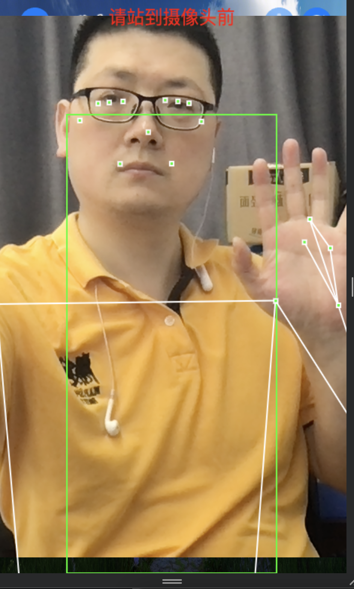

# 推箱子游戏

基于Trae、phaserjs、nodejs、typescript、vite、豆包等技术创建
在AI的帮助下，核心代码花了半天时间完成。

Author：github.com/surfsky
Last Update：2025-05

## 功能

- 经典推箱子游戏改版；
- 增加冰块地面，物体和角色会滑动，增加游戏难度和趣味性；
- 支持虚拟按键、键盘操作；
- 支持摄像头体感操作：
    右：右手平举
    左：左手平举
    上：双手上举
    下：下蹲
    ok: 敬礼或者奥特曼
- 支持AI自动寻路；

## 快照

## Task

实现盈利模式
    /实现 AI 自动过关能力。（基本实现，除了2个冰块地图）
    实现广告植入（过关ai提示）

实现双人模式
增加敌人，碰到会；用箱子推会夹死敌人。

优化视频体感识别
    组合判断当前姿势+前姿势，来判断当前动作。优化动作识别：要求每个指令动作的前动作必须是站立，不能偷懒。
    fixbug：手机端开启体感检测时，需只显示视频，而不显示视频外框
    增强手势识别，可在屏幕上显示一个手掌，手掌握拳表示按压
    
美化
    修正箱子图层低于冰块的bug
    参照《三个奇迹推箱子》美化场景
    响应式布局

## Done

/解决背景声音重复播放的问题。先判定音乐对象是否存在。
/优化首页Grid控件，自动换行
/优化滑动平滑一点
/删除参数 playerPos，改用精灵的data来存储
/确定：ok（增加其他视频体感识别能力，可识别手指头）***
/暂停：举单手(算了)
/返回：右滑
/实现ok手势
/参考恐龙烤火游戏部署冰块关卡
/实现冰地逻辑及相关关卡
    /实现冰块地面（编号为4），若玩家或物体进入冰块地面，则滑行直到非冰块地面时停止。
    /实现冰块地面测试关卡。
/修正第四关穿箱子的bug
/重构BoxGameScene，给箱子精灵增加xy参数，并修正 existBox(), findBox() 等方法，用xy参数来判定，而不是根据位置来判定。
    /简化关卡地图，把人也放进去（算了，脚下是什么地面就无法控制了）
    /修改推箱子逻辑：若玩家前面是箱子，按对应的方向键时，推动箱子一格，而人不动
/统一Control 的 origin为 （0，0）, popup/dialog 的 origin 为 （0.5，0.5）
/摄像头体感控制
/优化体感控制摄像头视频大小
